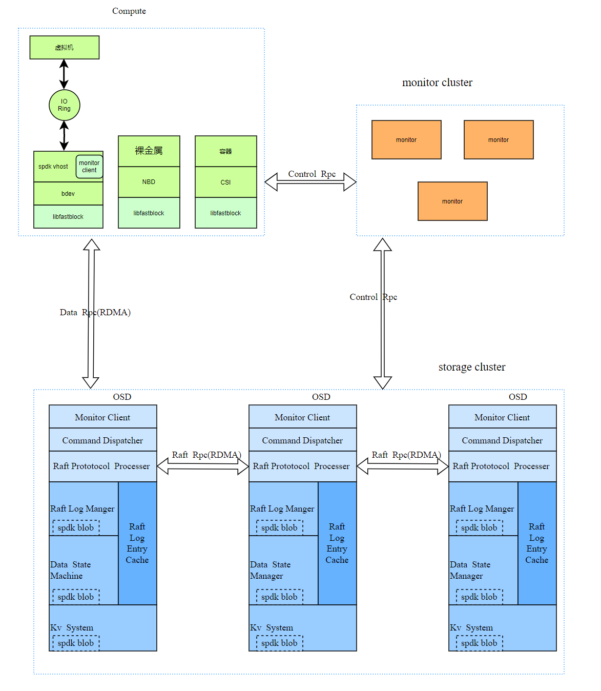
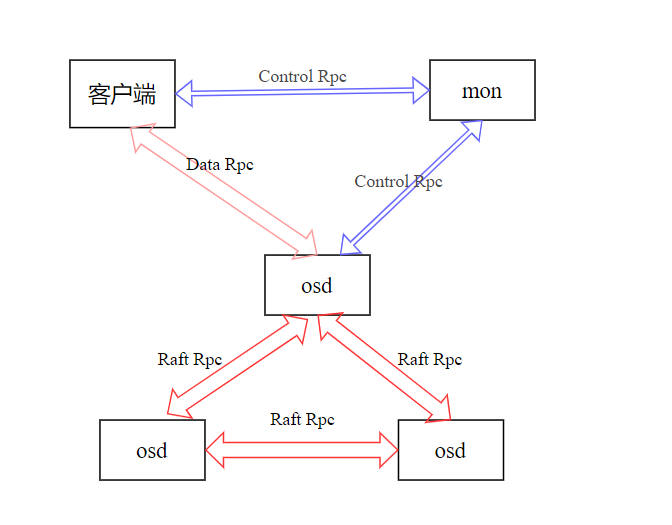
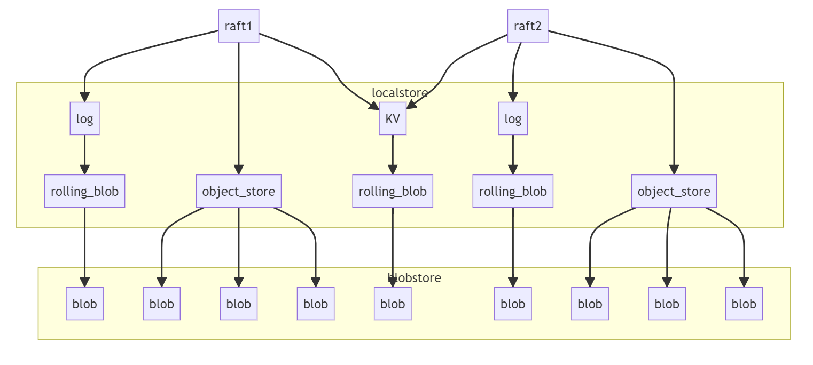

# fastblock
A distributed block storage system that uses mature Raft protocol and is designed for all-flash scenarios.

### Description
The current distribution block storage system(Ceph) is facing challenges that hinder its ability to meet the needs of performance, latency, cost, and stability. The main issues are:
* CPU Consumption: A significant amount of CPU resources is consumed, with the CPU becoming a bottleneck in nvme ssd clusters.
* Suboptimal Availability: The implementation of a master-slave strong synchronous replication strategy is proving to be a liability. It leads to I/O operations being suspended during instances of cluster jitter.
* Limited Performance on a Per-Volume Basis: Integration with QEMU reveals a marked degradation in performance. Stress testing also indicates the necessity for multiple volumes to maximize the cluster's throughput.
* Elevated Latency for Single Volumes: It is unable to capitalize on the low-latency advantages of NVMe devices. RBD typically exhibits latency in the millisecond range.
* Insufficient Concurrency Performance: There is a noticeable disparity between the IOPS and throughput achievable by the system compared to the potential offered by the underlying hardware.

**fastblock is designed to tackle the challenges of performance and latency issues in distributed block storage system. Its key features include:**

* **SPDK Framework Usage:** Using the SPDK framework, which leverages user-space NVMe drivers and lock-free queues to minimize I/O latency.
* **RDMA Network Cards Integration:** Incorporating RDMA network cards to facilitate zero-copy, kernel bypassing, and CPU-independent network communication.
* **Multi-Raft Data Replication:** Employing a multi-raft algorithm for data replication to ensure data reliability.
* **Reliable Cluster Metadata Management:** Offering a straightforward, reliable, and easily customizable approach to managing cluster metadata. 

### Software Architecture
The architecture is closely similar to Ceph, including many concepts such as monitor, OSD, and PG. For quick understanding, the architecture diagram is shown below.

* **Compute:** represents the compute services.
* **Monitor cluster:** Responsible for maintaining cluster metadata, including `osdMap`, `pg`, `pgMap`, `pool`, and `image`.
* **Storage cluster:** Each storage cluster comprises multiple Storage Nodes, and each Storage Node operates several OSDs.
* **Control RPC:** Using TCP sockets to transmit metadata.
* **Data RPC and Raft RPC:** Data RPC is for transferring data requests between clients and OSDs, while Raft RPC is used for transferring RPC messages between OSDs. Both Data RPC and Raft RPC employ protobuf and RDMA for communication.
* **Monitor Client:** A client module for communication with the monitor.
* **Command Dispatcher:** A message processing module that receives and handles data requests from clients.
* **Raft Protocol Processor:** Handles Raft RPC messages, elections, membership changes, and other operations as stipulated by the Raft protocol.
* **Raft Log Manager:** Manages and persists the Raft log, using SPDK blob for the persistence of the Raft log.
* **Data State Machine:** Stores user data using SPDK blobstore.
* **Raft Log Entry Cache:** Used for caching the Raft log to improve performance.
* **KV System:** Provides a key-value API, using SPDK blob for persistence.

### Components and Interaction

#### monitor
`monitor` is responsible for maintaining the status of storage nodes and managing node additions and deletions. It also handles the metadata for storage volumes, maintains the cluster's topological structure, responds to user requests for creating pools, and creates Raft groups on OSDs based on the current topology. 
As a cluster management tool, monitor does not store data itself and does not aim for extreme performance. Therefore, it is implemented in Golang and uses etcd for multi-replica storage.
The monitor cluster is crucial for ensuring consistency, as it provides a unified view to both clients and OSDs. For all client I/O operations, only the `PG` layer is visible. Both OSDs and clients initiate a timer at startup to periodically fetch `osdmap` and `pgmap` information from `monitor`. This ensures that all OSDs and clients perceive the same changes in PG status and respond accordingly. This design prevents write operations targeted at a specific PG from being incorrectly directed.
For more details, refer to [monitor documentation](monitor/README.md "monitor documentation").

#### OSD RPC 
RPC subsystem in fastblock is a crucial system that interconnects various modules. To accommodate heterogeneous networks, the RPC subsystem is implemented in two ways: socket-based (Control RPC) and RDMA-based (Data RPC and Raft RPC). Socket-based RPC follows the classic Linux socket application scenario, while RDMA-based RPC utilizes asynchronous RDMA (i.e., RDMA write) semantics.

There are three types of RPC interactions, as depicted in the diagram:
* **Control RPC**: Used for transferring `osdmap`, `pgmap`, and `image` information between clients and monitor, and between OSDs and monitor. Since these data are not large in volume and are not frequently transmitted, a socket-based implementation is suitable.
* **Data RPC**: Facilitates the transfer of object data operations and results between clients and OSDs. Due to the larger size and higher frequency of this data, RDMA-based methods are employed.
* **Raft RPC**: Used for transferring Raft RPC protocol contents among OSDs, which include object data. Similar to Data RPC, the larger data volumes and high frequency necessitate the use of RDMA-based methods.
Both Data RPC and Raft RPC utilize `protobuf`. The network communication parts employ RDMA, and RPC data serialization is managed using Protobuf.

#### OSD Raft
Raft achieves consistency in distributed systems by electing a leader and entrusting them with the responsibility of managing the replication log. The leader receives log entries from clients, replicates these entries to other servers, and coordinates when these entries can be safely applied to their state machines. There are many open-source implementations of Raft, and we referenced [Willemt's](https://github.com/willemt/raft "C language Raft implementation") C language raft implementation and additionally implemented multi-raft, which mainly includes:
* Management of Raft Groups: This involves the creation, modification, and deletion of Raft.
* Raft Election and Election Timeout Handling.
* Raft Log Processing: This includes caching logs, persisting logs to disk, and replicating logs to follower nodes.
* Data State Machine Processing: Managing the persistence of data to disk.
* Raft Snapshot Management and Log Recovery.
* Raft Membership Changes Management (not yet implemented).
* Raft Heartbeat Merging.

In a multi-group Raft setup, where multiple Raft groups coexist, each group's leader must send heartbeats to its followers. With many Raft groups, this could lead to an excessive number of heartbeats, consuming significant bandwidth and CPU resources. The solution is elegantly simple: since an `osd` might belong to multiple Raft groups, heartbeats can be consolidated for groups with the same leader and followers. This consolidation significantly reduces the number of heartbeat messages needed. For instance, consider a scenario with two PGs in Raft, namely `pg1` and `pg2`, where both include `osd1`, `osd2`, and `osd3`. `osd1` is the leader in this case. Without consolidation, `osd1` would need to send separate heartbeat messages for `pg1` and `pg2` to both `osd2` and `osd3`. However, with heartbeat consolidation, `osd1` only needs to send one combined heartbeat message to `osd2` and `osd3`.


#### OSD KV
The KV (Key-Value) subsystem is tailored for storing both the metadata of Raft and the data of the storage system itself. The design caters to the small scale of the data involved. It employs an in-memory hash map to store all the data, offering basic operations like `put`, `remove`, and `get`. To ensure data persistence, the modified data in the hash map is written to the disk at intervals of 10 milliseconds.

#### OSD Localstore
OSD localstore utilizes SPDK blobstore for data storage and is comprised of three key storage modules:
* **`disk_log`**: This module is responsible for storing the Raft log. Each PG corresponding to a Raft group, is associated with a specific SPDK blob.
* **`object_store`**: This module handles the storage of object data, where each object is mapped to an SPDK blob.
* **`kv_store`**: Each CPU core has its own SPDK blob, which stores all kv data required by that core. This includes Raft's metadata and the data of the storage system itself.
For instance, if two Rafts are running, the localstore provides these three types of storage functionalities - log, object, and KV - for both Rafts.


#### Client
Clients is designed for creating, modifying, and deleting images. It converts user operations on images into operations on objects (the basic data units processed by OSDs) and then packages these as Data PRC messages to be sent to the leader OSD of the PG. The client also receives and processes responses from the leader OSD and returns the results to the user. Clients operate in various modes to accommodate different environments and uses. These modes include spdk vhost for virtual machines, NBD for bare metal, and CSI for virtual machines. In all these modes, the libfastblock library is called to handle the conversion from images to objects and to communicate with the OSDs. The focus of this explanation is on the spdk vhost for virtual machines.
The client uses the SPDK library to create a vhost app. After initializing SPDK resources, a timer is set up to fetch `osdmap`, `pgmap` and `image` information from monitor. An SPDK script (`rpc.py`) is used to send requests to the vhost app for creating bdev (`bdev_fastblock_create`). Upon receiving a request, the vhost app creates an `image`, sends its information to the monitor, creates a bdev device, and then registers its operation interface (which calls the libfastblock library). The `rpc.py` script is also used to send requests to the vhost application for creating vhost-blk controller (`vhost_create_blk_controller`). Upon receiving the request, the vhost app opens the bdev device and registers a vhost driver to handle vhost message. This involves creating a socket for client connections (such as QEMU) and implementing connection services following the vhost protocol, a feature already estabilished in DPDK. Libfastblock converts user operations on images into operations on objects, encapsulates these into Data RPC messages, sends them to the leader OSD of the PG, and handles the responses from the leader OSD.

### Build and Compile
The source code is primarily organized into three directories: `src`, `monitor`, and `msg`, each serving distinct functions:
* `src` directory primarily contains the implementation of Raft, RDMA communication, the underlying storage engine, and block layer API encapsulations. For more details, you can refer to the [documentation of src](src/README.md).
* `monitor` directory includes features related to cluster metadata storage management, monitor elections, PG allocation, and distribution of `clustermap`. Detailed information about this directory can be found in the [documentation of monitor](monitor/README.md).
* `msg` directory contains all the implementations of RDMA RPC, along with a simple demo illustrating its use.

For the first compilation, you need to acquire dependencies such as SPDK and abseil-cpp by running the following command:
```
./install-deps.sh
```
You can compile the Release versions of `monitor` and `osd` by running the following command:
```
./build.sh -t Release -c monitor
./build.sh -t Release -c osd
```
After compilation, the binaries for `fastblock-mon` and `fastblock-client` will be located in the `mon/` directory, while `fastblock-osd` and `fastblock-vhost` binaries will be found in the `build/src/osd/` and `build/src/bdev` directories, respectively. For subsequent modifications, if there are code changes in the OSD or vhost, recompilation can be done directly in the `build/` directory. Similarly, for any updates to the monitor, a simple `make` command in the `mon/` directory suffices.

### Deploy and Test
According to the [Deployment and Performance Test Report](docs/performance_test_1012.md), in our test environment, with each OSD utilizing only one core, we achieved a latency of less than 100 microseconds for 4K random writes in a single thread, along with concurrent performance of 410,000 IOPS.

### Future Works
* **Volume snapshot and snapshot group features implementation.**
* **Volume Qos implementation.**
* **Multi-core performance optimization for osd and client.**
* **Recoverability and optimization of local storage engine.**
* **Testing system addition**, adding a testing system for unit tests, integration tests, and particularly fault testing of the Raft layer and local storage engine.
* **CI system integration.**
* **Customizable pg allocation plugin.**
* **Raft membership changes and coordination with pg allocation.**
* **Optimization of RDMA connection management in osd client.**
* **Support for DPU offload of vhost.**
* **Monitoring data export and cluster runtime data display.**
* **Deployment tool development and simplification of system configuration files.**
* **Volume encryption and decryption support.**
* **Volume sharing support.**

### Contribution

1.  Fork the repository
2.  Create Feat_xxx branch
3.  Commit your code
4.  Create Pull Request

### Gitee Feature

1.  You can use Readme\_XXX.md to support different languages, such as Readme\_en.md, Readme\_zh.md
2.  Gitee blog [blog.gitee.com](https://blog.gitee.com)
3.  Explore open source project [https://gitee.com/explore](https://gitee.com/explore)
4.  The most valuable open source project [GVP](https://gitee.com/gvp)
5.  The manual of Gitee [https://gitee.com/help](https://gitee.com/help)
6.  The most popular members  [https://gitee.com/gitee-stars/](https://gitee.com/gitee-stars/)
