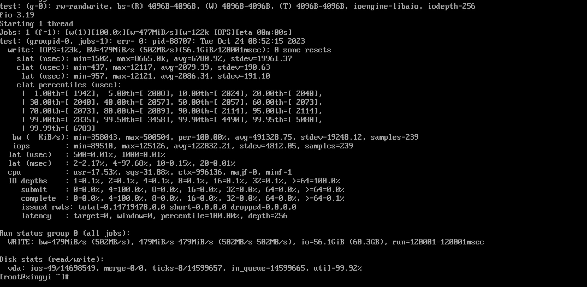

部署及性能测试报告
# 测试环境
- 服务器: 此次使用三台同配置的服务器(fastblock143,fastblock144,fastblock145)进行集群模式测试，CPU为40核80线程的Intel Gold 6230
- 网络：  服务器之间使用25G交换机直连，384G内存, CPU采用性能模式
- 磁盘：测试是采用12个P4510作为后端存储, 采用spdk nvme用户态驱动进行测试
- 测试项: 三副本的测试条件下, 使用block_bench和对接vhost后在虚拟机内进行性能测试， 测出iops、平均延迟和延迟分位统计
- 其它: 测试时，所有进程都仅使用一个核，且是大核，避免使用同一个物理核上的两个线程，请一定避免不同进程使用相同的核，否则性能会大大降级

# 测试步骤:
## 0. 环境准备
准备huge page:  
```
echo 32768 > /sys/devices/system/node/node0/hugepages/hugepages-2048kB/nr_hugepages
echo 32768 > /sys/devices/system/node/node1/hugepages/hugepages-2048kB/nr_hugepages
```

## 1.部署monitor集群并启动monitor
monitor运行在172.31.77.144(fastblock144)上，monitor配置文件 *monitor.toml* 如下:  
```toml
etcd_server = ["172.31.77.144:2379"] # Your etcd servers.
address = "172.31.77.144"
etcd_name = "monitor1"
etcd_initial_cluster = "monitor1=http://172.31.77.144:2380"
etcd_advertise_client_urls = ["http://172.31.77.144:2379"]
etcd_advertise_peer_urls = ["http://172.31.77.144:2380"]
etcd_listen_peer_urls = ["http://172.31.77.144:2380"]
etcd_listen_client_urls = ["http://172.31.77.144:2379"]
data_dir = "/tmp/etcddir"

election_master_key = "fastblock_monitor_election"
hostname="monitor1"
port=3333
prometheus_port=3332
log_path = "/var/log/fastblock/monitor1.log"
log_level = "info"
```
启动monitor进程:  
```
fastblock-mon -conf monitor.toml &
```
因monitor需要一定的时间(10s左右)进行etcd选举，然后才会开放tcp rpc端口影响fastblock-client和fastblock-osd的请求。


## 2.配置osd并启动osd:
osd的配置文件包含两个部分，一个是spdk bdev的配置文件，一个是osd的配置文件，两个配置文件都是json格式的.  
nvme驱动的bdev文件形如:  
```json
{
    "subsystems": [
      {
        "subsystem": "bdev",
        "config": [
          {
            "method": "bdev_nvme_attach_controller",
            "params": {
              "name": "test1",
              "trtype": "pcie",
              "traddr": "0000:18:00.0"
            }
          }
        ]
      }
    ]
}
```
uuid需要向monitor进行申请，命令行为:  
```bash
uuid=`uudigen`
fastblock-client -op=fakeapplyid -uuid=$uuid -endpoint=172.31.77.144:3333
```
将上面申请的uuid填充到osd的配置文件中，osd配置文件形如:    
```json
{
    "current_osd_id": 1,
    "osds": [
        {
            "pid_path": "/var/tmp/osd_1.pid",
            "osd_id": 1,
            "bdev_disk": "nvme0n1",
            "address": "172.31.4.144",
            "port": 9001,
            "uuid": "$uuid",
            "monitor": [
                {"host": "127.0.0.1", "port": 3333},
                {"host": "127.0.0.1", "port": 4333},
                {"host": "127.0.0.1", "port": 5333}
            ]
        }
    ],

    "msg": {
        "server": {
            "listen_backlog": 1024,
            "poll_cq_batch_size": 32,
            "metadata_memory_pool_capacity": 16384,
            "metadata_memory_pool_element_size_byte": 1024,
            "data_memory_pool_capacity": 16384,
            "data_memory_pool_element_size_byte": 8192,
            "per_post_recv_num": 512,
            "rpc_timeout_us": 1000000
        },

        "client": {
            "poll_cq_batch_size": 32,
            "metadata_memory_pool_capacity": 16384,
            "metadata_memory_pool_element_size_byte": 1024,
            "data_memory_pool_capacity": 16384,
            "data_memory_pool_element_size_byte": 8192,
            "per_post_recv_num": 512,
            "rpc_timeout_us": 1000000,
            "rpc_batch_size": 1024
        },

        "rdma": {
            "resolve_timeout_us": 2000,
            "poll_cm_event_timeout_us": 1000000,
            "max_send_wr": 4096,
            "max_send_sge": 128,
            "max_recv_wr": 8192,
            "max_recv_sge": 1,
            "max_inline_data": 16,
            "cq_num_entries": 1024,
            "qp_sig_all": false,
            "rdma_device_name": "mlx5_0"
        }
    }
}
```

然后启动osd进程:  

```
/root/fb/fastblock/build/src/osd/fastblock-osd -m '['1']' -c bdev_1.json -C osd1.json
```
按照上面的方式依次配置fastlock143,fastblock144,fastblock145三个节点上的12个osd，此时集群中便有了36个osd.
注意，通过测试数据发现，每台服务器上的12个osd最好每6个跑在不同的numa节点上。  

## 3.创建pool和image：
```
fastblock-client -op=createpool -poolname=fb -pgcount=128 -pgsize=3
fastblock-client -op=createimage -imagesize=$((100*1024*1024*1024))  -imagename=fbimage -poolname=fb
```
注意，创建pool之后，需要稍微等待raft选出pg的leader才可进行IO和性能测试。  

## 4.启动fastblock-vhost，并初始化供qemu对接的bdev:  

vhost.json 作为 `fastblock-vhost` 的配置文件如下：

```json
{
    "pid_path": "/var/tmp/socket.bdev.sock",
    "vhost_socket_path": "/var/tmp/bdev_vhost.sock",
    "monitor": [
        {"host": "127.0.0.1", "port": 3333},
        {"host": "127.0.0.1", "port": 4333},
        {"host": "127.0.0.1", "port": 5333}
    ],
    "msg": {
        "client": {
            "poll_cq_batch_size": 1024,
            "metadata_memory_pool_capacity": 4096,
            "metadata_memory_pool_element_size_byte": 1024,
            "data_memory_pool_capacity": 4096,
            "data_memory_pool_element_size_byte": 8192,
            "per_post_recv_num": 512,
            "rpc_timeout_us": 1000000,
            "rpc_batch_size": 1024
        },

        "rdma": {
            "resolve_timeout_us": 2000,
            "poll_cm_event_timeout_us": 1000000,
            "max_send_wr": 1024,
            "max_send_sge": 128,
            "max_recv_wr": 8192,
            "max_recv_sge": 1,
            "max_inline_data": 16,
            "cq_num_entries": 1024,
            "qp_sig_all": false
        }
    }
}

```

```shell
/root/fastblock/build/src/bdev/fastblock-vhost -m ['8'] -C vhost.json &
/root/spdk/scripts/rpc.py -s /var/tmp/socket.bdev.sock  bdev_fastblock_create -P 1 -p fb -i fbimage -k 4096 -I 100G -m "127.0.0.1:3333" -b fbdev
/root/spdk/scripts/rpc.py -s /var/tmp/socket.bdev.sock  vhost_create_blk_controller --cpumask 0x8 vhost.1 fbdev
```
注意, fastblock-vhost也是一个spdk app，也是需要绑核的，且第三条命令行中绑定的cpumask要跟fastblock-vhost进程绑定的核一致。

## 5.启动qemu:
直接使用qemu命令行启动时，命令行如下:  
```
taskset -c 36,37,38,39 \
qemu-system-x86_64 \
  --enable-kvm \
  -cpu host -smp 4 \
  -m 8G -object memory-backend-file,id=mem0,size=8G,mem-path=/dev/hugepages,share=on -numa node,memdev=mem0 \
  -drive file=/home/CentOS-8-GenericCloud-8.4.2105-20210603.0.x86_64.qcow2,if=none,id=disk \
  -device ide-hd,drive=disk,bootindex=0 \
  -chardev socket,id=spdk_vhost_blk0,path=vhost.1 \
  -device vhost-user-blk-pci,chardev=spdk_vhost_blk0,num-queues=2 \
  -netdev user,id=ethernet.0,hostfwd=tcp::2223-:22 \
  -device rtl8139,netdev=ethernet.0 \
  -vnc 0.0.0.0:1
```
如要使用libvirt启动，则xml形如:  
```
<domain type='kvm'>
  <name>wocloud2</name>
  <uuid>ce9eadc4-8336-420c-8bc2-5e57cc0f1613</uuid>
  <memory unit='KiB'>8388608</memory>
  <currentMemory unit='KiB'>8388608</currentMemory>
  <memoryBacking>
    <hugepages>
      <page size='2048' unit='KiB'/>
    </hugepages>
    <nosharepages/>
    <locked/>
    <source type='file'/>
    <access mode='shared'/>
    <discard/>
  </memoryBacking>
  <vcpu placement='static'>8</vcpu>
  <cputune>
    <vcpupin vcpu='0' cpuset='36'/>
    <vcpupin vcpu='1' cpuset='37'/>
    <vcpupin vcpu='2' cpuset='38'/>
    <vcpupin vcpu='3' cpuset='39'/>
  </cputune>
  <os>
    <type arch='x86_64' machine='pc-i440fx-6.0'>hvm</type>
    <boot dev='hd'/>
  </os>
  <features>
    <acpi/>
    <apic/>
    <pae/>
  </features>
  <cpu mode='custom' match='exact' check='none'>
    <model fallback='forbid'>qemu64</model>
  </cpu>
  <clock offset='localtime'/>
  <on_poweroff>destroy</on_poweroff>
  <on_reboot>restart</on_reboot>
  <on_crash>destroy</on_crash>
  <devices>
    <emulator>/usr/bin/qemu-system-x86_64</emulator>
    <disk type='file' device='disk'>
      <driver name='qemu' type='qcow2'/>
      <source file='/home/CentOS-8-GenericCloud-8.4.2105-20210603.0.x86_64.qcow2'/>
      <target dev='hda' bus='ide'/>
      <address type='drive' controller='0' bus='0' target='0' unit='0'/>
    </disk>
    <disk type='vhostuser' device='disk' snapshot='no'>
      <driver name='qemu' type='raw' queues='2'/>
      <source type='unix' path='/root/fb/fastblock/build/src/bdev/vhost.1'/>
      <target dev='vda' bus='virtio'/>
      <address type='pci' domain='0x0000' bus='0x00' slot='0x04' function='0x0'/>
    </disk>
    <controller type='usb' index='0' model='piix3-uhci'>
      <address type='pci' domain='0x0000' bus='0x00' slot='0x01' function='0x2'/>
    </controller>
    <controller type='pci' index='0' model='pci-root'/>
    <controller type='ide' index='0'>
      <address type='pci' domain='0x0000' bus='0x00' slot='0x01' function='0x1'/>
    </controller>
    <interface type='bridge'>
      <mac address='00:16:3e:5d:11:a0'/>
      <source bridge='br0'/>
      <model type='rtl8139'/>
      <address type='pci' domain='0x0000' bus='0x00' slot='0x03' function='0x0'/>
    </interface>
    <input type='mouse' bus='ps2'/>
    <input type='keyboard' bus='ps2'/>
    <graphics type='vnc' port='-1' autoport='yes' listen='0.0.0.0' keymap='en-us'>
      <listen type='address' address='0.0.0.0'/>
    </graphics>
    <audio id='1' type='none'/>
    <video>
      <model type='cirrus' vram='16384' heads='1' primary='yes'/>
      <address type='pci' domain='0x0000' bus='0x00' slot='0x02' function='0x0'/>
    </video>
    <memballoon model='virtio'>
      <address type='pci' domain='0x0000' bus='0x00' slot='0x05' function='0x0'/>
    </memballoon>
  </devices>
</domain>
```

## 6.获取集群信息:  
```
etcdctl get --prefix "" --endpoints=http://172.31.77.144:2379
``` 

## 7.使用block_bench进行性能测试
block_bench是直接对接调用libfblock库的spdk app，可以直接使用多个核下发IO进行性能测试  
对于4k随机写，block_bench需要使用一个json配置文件，形如:  
```json
{
    "io_type": "write",
    "io_size": 4096,
    "io_count": 1,
    "io_depth": 8,
    "io_queue_size": 128,
    "io_queue_request": 4096,
    "image_name": "test_image",
    "image_size": 2907152,
    "object_size": 1048576,
    "pool_id": 1,
    "pool_name": "test_bdev_2",
    "monitor": [
        {"host": "127.0.0.1", "port": 3333},
        {"host": "127.0.0.1", "port": 4333},
        {"host": "127.0.0.1", "port": 5333}
    ],
    "msg": {
        "client": {
            "poll_cq_batch_size": 8,
            "metadata_memory_pool_capacity": 16384,
            "metadata_memory_pool_element_size_byte": 1024,
            "data_memory_pool_capacity": 16384,
            "data_memory_pool_element_size_byte": 8192,
            "per_post_recv_num": 512,
            "rpc_timeout_us": 1000000,
            "rpc_batch_size": 1024
        },

        "rdma": {
            "resolve_timeout_us": 2000,
            "poll_cm_event_timeout_us": 1000000,
            "max_send_wr": 4096,
            "max_send_sge": 128,
            "max_recv_wr": 8192,
            "max_recv_sge": 128,
            "max_inline_data": 16,
            "cq_num_entries": 1024,
            "qp_sig_all": false
        }
    }
}
```
使用4个物理核时，启动测试的方式为:  
```
build/tools/block_bench  -m ['0,13,34,35'] -C fb.json
```
注意, block_bench也是一个spdk app，也是需要绑核的，请避免与fastblock-osd和fastblock-vhost使用相同的核。
可修改json文件，进行qd=1和qd=256两种测试，前者关注的是系统延迟情况，后者关注集群的并发IO情况。  

## 8.虚拟机内使用fio进行测试
4k随机写, qd=1测试:
```
fio -direct=1 -iodepth=1 -thread -rw=randwrite -bs=4096 -numjobs=1 -runtime=300 -group_reporting  -name=test -filename=/dev/sda -ioengine=libaio
```
4k随机写, qd=128测试:
```
fio -direct=1 -iodepth=128 -thread -rw=randwrite -bs=4096 -numjobs=1 -runtime=300 -group_reporting  -name=test -filename=/dev/sda -ioengine=libaio
```

# 测试结果:

## 1.block_bench测试结果
使用8个核，当qd=128时4k随机写的延迟分位数及iops结果为:  
```
root@fastblock144:~# ~/fb/fastblock/build/tools/block_bench  -m ['0,13,14,15,31,32,33,34'] -C test128.json
===============================[write latency]========================================
p0.1: 7374.4us, p0.5: 8128.44us, p0.9: 8798.6us, p0.95: 9013.46us, p0.99: 9598.97us, p0.999: 38120.6us, mean: 8481.18us, min: 627.374us, max: 524712us, biased stdv: 12821.7, iops: 471218
======================================================================================
```

qd=1时4k随机写的延迟分位数及iops结果为:   
```
root@fastblock144:~# ~/fb/fastblock/build/tools/block_bench  -m ['39'] -C test1.json
===============================[write latency]========================================
p0.1: 82.2914us, p0.5: 92.6276us, p0.9: 100.295us, p0.95: 102.398us, p0.99: 111.49us, p0.999: 190.58us, mean: 98.3998us, min: 73.6381us, max: 40057.1us, biased stdv: 422.276, iops: 10156
======================================================================================
```

## 2.虚拟机内部测试结果:
使用4个核，当qd=256时4k随机写的延迟分位数及iops结果为: 

qd=1时4k随机写的延迟分位数及iops结果为:  


从结果看，单核的结果，使用block_bench和虚拟机内部运行结果基本一致，但是虚拟机内部跑高并发测试时，性能略于使用block_bench的结果，问题应该出在bdev的多核支持上，将在下一版本优化。