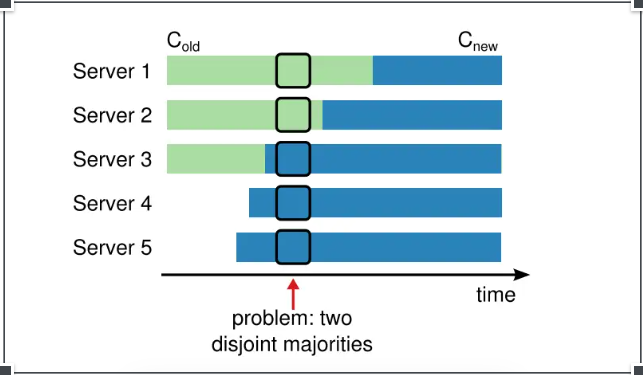
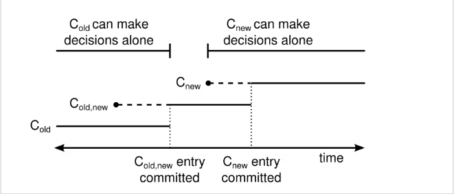

# 一 raft成员变更
## 1 raft论文中成员变更方法

   成员变更是个一致性问题，所有的成员需要对新成员达成一致，如果直接向Leader节点发送成员变更请求，Leader同步成员变更日志给所有成员，达成多数派之后提交，各节点提交成员变更日志后从旧成员配置（Cold）切换到新成员配置（Cnew）。但这样会导致一个问题：
   如果一次添加多个节点，各个节点提交成员变更日志的时刻可能不同，造成各个节点从旧成员配置（Cold）切换到新成员配置（Cnew）的时刻不同。会导致某一时刻出现Cold和Cnew中同时存在两个不相交的多数派，可能选出两个Leader，破坏安全性。如下图所示，图中的server1和server2成为Cold的多数派，server3、server4和server5成为Cnew的多数派。


成员变更需要解决这个问题，raft论文提供了两种方法：
### 1.1 单步成员变更（One-Step）
   每次只添加或删除一个节点，这样可以保证在任何时刻都不会出现Cold和Cnew中存在两个不相交的多数派。一次变更完成后，再开始下一次。
   单步变更过程中如果发生Leader切换会出现正确性问题，可能导致已经提交的日志又被覆盖，为了解决这个问题，Leader上任后先提交一条no-op日志。
   单步成员变更每次只能添加或删除一个成员，在做成员替换的时候需要分两次变更，如果第一次添加新成员，第二次删除旧成员，中间可能会出现网络分区，导致服务不可用。因此需要先删除老成员，再添加新成员。
   当新节点被添加到raft时，它通常不会存储任何日志条目，它的日志可能需要相当长的时间才能赶上leader的日志，在此期间，raft容易受到不可用的影响。为了解决这个问题，Raft在配置改变之前引入了一个额外的阶段，在这个阶段，新添加到raft的节点作为一个non-voting成员，leader复制log entry给它，但在voting和commit统计多数时，它并不统计入总数。当新添加的节点赶上集群中其它的服务器，再进行正常的配置变更。
   优点：实现比较简单
   缺点：每次只能变更单个节点，不利于raft维护。并且替换节点时，先要删除旧节点，降低了副本数，有安全性风险。

### 1.2 联合一致成员变更（Joint Consensus）
   把旧成员配置Cold和新成员配置Cnew 组合为Cold,new，是一个过渡成员配置，一旦这个过渡成员配置Cold,new提交，再切换到新成员配置Cnew 。
   

   Leader收到成员变更请求后，先向Cold和Cnew中的所有节点发送一条Cold,new日志，等到Cold,new日志在Cold和Cnew分别都达成多数派之后才能提交。Leader的Cold,new 提交（commit）后，再向Cold和Cnew中的所有节点同步一条只包含Cnew的日志，Cnew日志只需要Cnew达成多数派后就能提交。Leader的Cnew提交后，成员变更完成，不在Cnew中的成员可以下线。
   联合一致成员变更有个问题：添加节点时，Leader向Cold和Cnew中的所有节点发送Cold,new日志需要在Cold和Cnew分别都达成多数派之后才能提交，提交之后才能继续后面的操作。新添加的节点需要追赶上leader的日志后才能提交Cold,new日志，如果此节点是空的，它可能会花费很长时间才能追上leader，导致成员变更卡在这一步，Leader的Cold,new日志迟迟无法提交，也会影响后续收到的客户端请求，影响可用性。
   优点： 一次可以变更多个成员，便于raft维护
   缺点： 新添加的节点可能需要很长时间才能追上leader，导致Leader的Cold,new日志迟迟无法提交，影响可用性。

## 2 raft成员变更方法改进
   在分布式系统中，扩容、替换坏盘或故障服务器是非常基本的需求，在设计raft成员变更时要考虑业务的安全性、可用性和便于维护。
   由于单步成员变更的缺点：每次只能变更单个节点，不利于raft维护；并且替换节点时，先要删除旧节点，降低了副本数，有安全性风险。
   联合一致成员变更（Joint Consensus）的方法可以很方便的替换节点，但是它的缺点也很明显：新添加的节点可能需要很长时间才能追上leader，导致Leader的Cold,new日志迟迟无法提交，影响可用性。
   新添加的节点可能需要很长时间才能追上leader，这是由leader领先新添加的数据量决定的，这个无可避免，只能从造成的结果“Leader的Cold,new日志迟迟无法提交”入手。把新添加的节点追赶leader这步提前，加快Leader的Cold,new日志提交，尽可能减少影响leader处理后续的客户端请求。在正常的流程之前加入一个追赶阶段，在此阶段leader给所有要添加的节点发送一个空的append entry request，用于触发要添加的节点追赶leader，在此阶段只有leader知道要添加的节点的存在，在voting和commit统计多数时，它并不统计入总数，此阶段类似与单步变更的non-voting阶段。
   还有一点可以优化，如果一次变更只添加或删除一个节点，则可以按单步变更来处理，更新成员配置列表，把新的成员配置表发送给新成员配置表里的所有成员，达成多数后，节点配置完成。为了解决单步变更的正确性问题，Leader上任后先提交一条no-op日志。
   改进后的成员变更相当于单步变更和联合一致变更的结合，接下来介绍整个流程。

   为成员变更提供三个接口:
```c++
    //添加单个成员
    void add_raft_membership(const raft_node_info& node, utils::context* complete);
    //删除单个成员
    void remove_raft_membership(const raft_node_info& node, utils::context* complete);
    //变更多个成员
    void change_raft_membership(std::vector<raft_node_info>&& new_nodes, utils::context* complete);
```
   这三个接口都是raft类raft_server_t的成员函数
   
### 2.1 raft成员变更流程
   只有leader才能处理成员变更。
   改进后的成员变更分为5个阶段：开始阶段，追赶阶段，联合一致阶段，同步新配置阶段、清理阶段，四个节点顺序进行。上一次的成员变更完成后，才能执行下一次的成员变更。
   相应的raft成员变更分为5个状态：
```c++
enum class cfg_state {
    /*  此阶段表示没有成员变更 */
    CFG_NONE = 0,
    /* 成员变更开始阶段 */
    CFG_CATCHING_START,
    /* 成员变更追赶阶段，只有添加成员（包括替换成员里的添加成员）时，才会进入这个阶段，类似于单步成员变更 */
    CFG_CATCHING_UP,
    /* 联合一致阶段 */
    CFG_JOINT,
    /* 
     * 更新配置阶段，把新的成员配置表发送给新成员配置表里的所有成员，达到多数派后，变更结束。
     * */
    CFG_UPDATE_NEW_CFG
};
```
  成员变更流程：
   - **开始阶段**
   这个阶段是成员变更的初始阶段。
   收到成员变更的请求后检查下一步进入CFG_CATCHING_UP状态还是CFG_CATCHING_UP阶段，生成一个raft entry添加到raft entry队列中等待处理。
```c++ protobuf
// Entry that is stored in the server's entry log. 
message raft_entry_t
{
    /** the entry's term at the point it was created */
    int64 term = 1;

    int64 idx = 2;

    /** type of entry */
    int32 type = 3;
    bytes meta = 4;
    bytes data = 5;
}
```
   其中的type表示raft entry的类型，有四种类型：RAFT_LOGTYPE_WRITE和RAFT_LOGTYPE_DELETE用于对象操作，RAFT_LOGTYPE_ADD_NONVOTING_NODE和RAFT_LOGTYPE_CONFIGURATION用于成员变更
```c++
typedef enum {
    /**
     * Regular log type.
     * This is solely for application data intended for the FSM.
     */
    RAFT_LOGTYPE_WRITE,
    RAFT_LOGTYPE_DELETE,
    
    /**
     * Membership change.
     * Non-voting nodes can't cast votes or start elections.
     * Used to start the first phase of a member change: catch up with the leader,
     */
    RAFT_LOGTYPE_ADD_NONVOTING_NODE,

    RAFT_LOGTYPE_CONFIGURATION,
} raft_logtype_e;  
```
   当有添加新成员（包括add_raft_membership和change_raft_membership里面的添加新成员）时，生成的raft entry的type是RAFT_LOGTYPE_ADD_NONVOTING_NODE；否则，生成的raft entry的type是RAFT_LOGTYPE_CONFIGURATION。

   - **追赶阶段**
   
   处理上个阶段的raft entry时，type为RAFT_LOGTYPE_ADD_NONVOTING_NODE才会进入这个阶段。
```c++
void raft_server_t::process_conf_change_add_nonvoting(std::shared_ptr<raft_entry_t> entry)；   
``` 

   在函数process_conf_change_add_nonvoting里处理这个raft entry，leader设置状态为CFG_CATCHING_UP，给所有要添加的节点发送一个空的append entry request请求，此节点收到此请求后，如果发现它的日志落后于leader，就会触发recovery，追赶leader。此阶段添加的这些节点不参与raft正常的达成多数派。
    这里的关键是这一个阶段什么时候结束，因为leader可能不断的收到客户端请求，它的日志就不断增长，要让新添加节点完全追赶上也不现实。可以设置一个追赶目标，达到此目标后，就可以结束此阶段，进入下一阶段。
    追赶目标：当上一轮追赶（recovery）完成后，检查leader比新添加节点的领先数量，如果数量小于某个值，就可以认为追赶上。这个值默认设为200。
    一次变更只添加或删除一个节点时，不会进入联合一致阶段，直接进入同步新配置阶段。
    进入下一阶段是通过生成一个raft entry（type为RAFT_LOGTYPE_CONFIGURATION）添加到raft entry队列中开始的。

   - **联合一致阶段**
   
   处理上个阶段的raft entry时，在函数process_conf_change_configuration里判断是否进入此阶段
```c++
void raft_server_t::process_conf_change_configuration(std::shared_ptr<raft_entry_t> entry){
    SPDK_INFOLOG_EX(pg_group, "process entry type %d, index: %ld \n", entry->type(), entry->idx());
    raft_configuration config;
    config.ParseFromString(entry->meta());

    int old_node_size = config.old_nodes_size();
    if(old_node_size > 0){
        set_configuration_state(cfg_state::CFG_JOINT);
    }else{
        set_configuration_index(entry->idx());
        set_configuration_state(cfg_state::CFG_UPDATE_NEW_CFG);
    }
    
    ......
} 
``` 
   leader向Cold和Cnew中的所有节点发送一条包含Cold所有成员和Cnew所有成员的append entry request（类型为RAFT_LOGTYPE_CONFIGURATION），leader的这个请求需要在Cold和Cnew分别都达成多数派之后，可以提交，结束此阶段。此阶段新添加的节点可能还落后于leader，会触发recovery，追赶leader，但是落后的已经不多（上一步追赶阶段已经追赶了大部分），很快就可以追赶上。
   进入下一阶段是通过生成一个raft entry（type为RAFT_LOGTYPE_CONFIGURATION）添加到raft entry队列中开始的。
   - **同步新配置阶段**

   处理上个阶段的raft entry时，在函数process_conf_change_configuration里判断是否进入此阶段
   leader更新成员配置列表，把新的成员配置表发送给新成员配置表里的所有成员，达到多数派后，可以提交，结束此阶段。到这里起始成员配置变更已经结束，后续是一些清理操作。
   - **清理阶段**
 
   当leader已经从raft中被删除，leader会选择一个raft的新配置列表中的节点，给它发送TimeoutNow请求，此节点收到这个请求会触发一个新的选举。 leader删除时需要注意停止recovery等leader的操作。


作者：刘闳全

时间：2024/1/18
